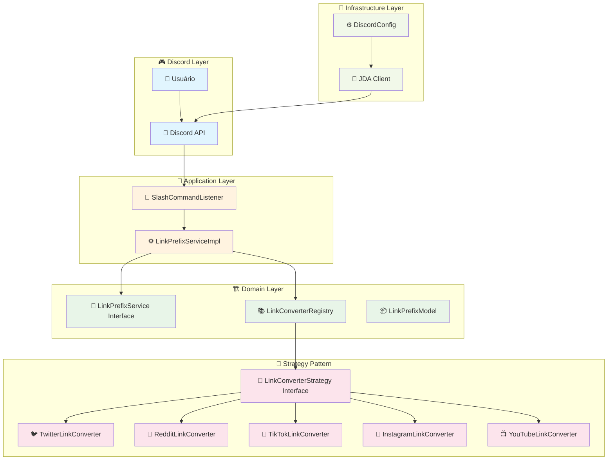
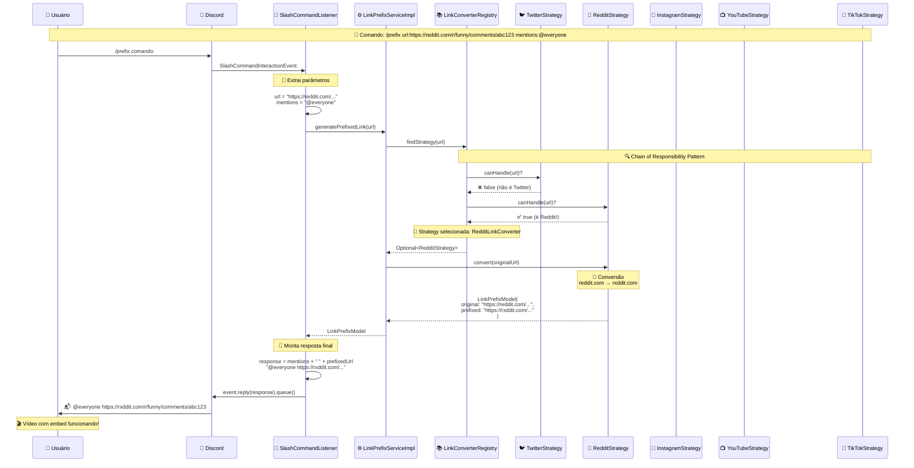
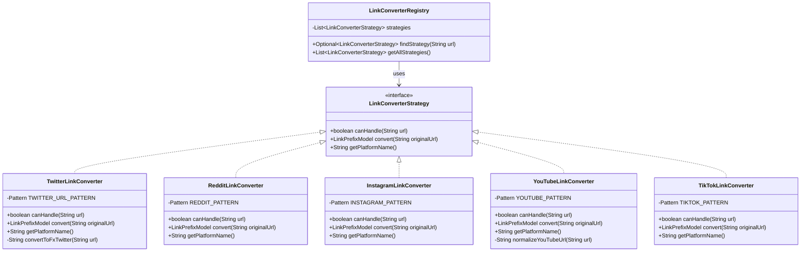
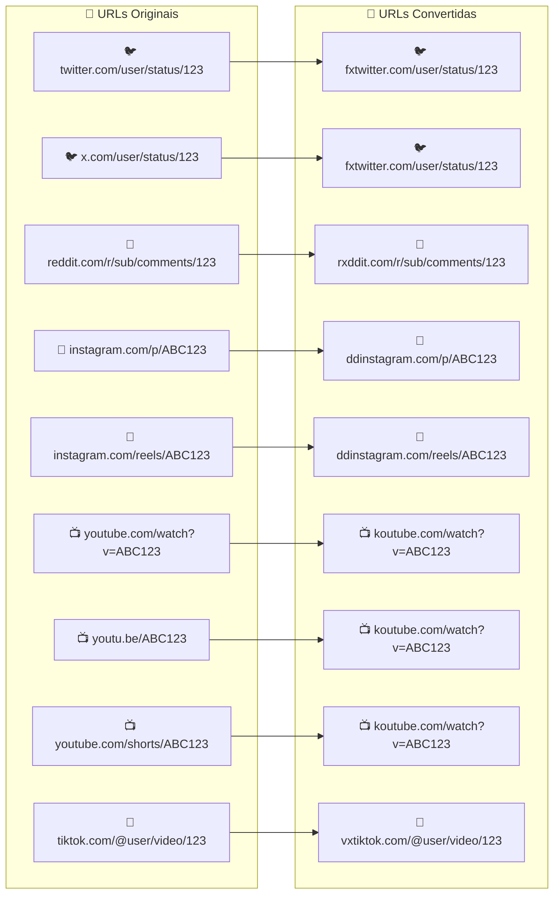
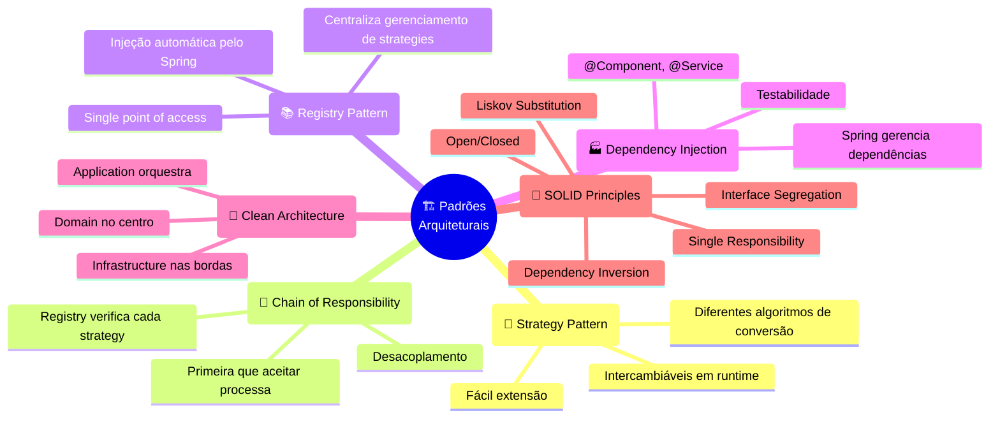

# ZeinzinhoBot - Arquitetura e Fluxo de Conversão de Links

## 📋 Visão Geral da Arquitetura



## 🔄 Fluxo Detalhado - Exemplo Reddit



## 🎯 Strategy Pattern em Detalhes



## 📊 Conversões Suportadas



## 🧪 Padrões Arquiteturais Aplicados



---

## 🎯 Como Adicionar Nova Plataforma

Para adicionar suporte a uma nova plataforma (ex: Facebook), você só precisa:

1. **Criar nova Strategy**:

```java
@Component
public class FacebookLinkConverter implements LinkConverterStrategy {
    // Implementar os 3 métodos da interface
}
```

2. **Spring faz o resto automaticamente!** 🚀
   - Registry detecta a nova strategy
   - Injeta na lista de strategies
   - Fica disponível para uso

**Zero configuração adicional necessária!** ✨

---

_Esta documentação foi gerada automaticamente baseada na análise do código-fonte do ZeinzinhoBot._
