# ZeinzinhoBot - Arquitetura e Fluxo de Conversão de Links

## 📋 Visão Geral da Arquitetura

```mermaid
graph TB
    subgraph "🎮 Discord Layer"
        USER[👤 Usuário]
        DISCORD[🤖 Discord API]
    end

    subgraph "🔧 Application Layer"
        LISTENER[📡 SlashCommandListener]
        SERVICE_IMPL[⚙️ LinkPrefixServiceImpl]
    end

    subgraph "🏗️ Domain Layer"
        SERVICE_INTERFACE[📜 LinkPrefixService Interface]
        REGISTRY[📚 LinkConverterRegistry]
        MODEL[📦 LinkPrefixModel]
    end

    subgraph "🎯 Strategy Pattern"
        STRATEGY_INTERFACE[📜 LinkConverterStrategy Interface]
        TWITTER[🐦 TwitterLinkConverter]
        REDDIT[📰 RedditLinkConverter]
        TIKTOK[🎵 TikTokLinkConverter]
        INSTAGRAM[📸 InstagramLinkConverter]
        YOUTUBE[📺 YouTubeLinkConverter]
    end

    subgraph "🔧 Infrastructure Layer"
        CONFIG[⚙️ DiscordConfig]
        JDA[🔌 JDA Client]
    end

    USER --> DISCORD
    DISCORD --> LISTENER
    LISTENER --> SERVICE_IMPL
    SERVICE_IMPL --> SERVICE_INTERFACE
    SERVICE_IMPL --> REGISTRY
    REGISTRY --> STRATEGY_INTERFACE
    STRATEGY_INTERFACE --> TWITTER
    STRATEGY_INTERFACE --> REDDIT
    STRATEGY_INTERFACE --> TIKTOK
    STRATEGY_INTERFACE --> INSTAGRAM
    STRATEGY_INTERFACE --> YOUTUBE
    CONFIG --> JDA
    JDA --> DISCORD

    classDef userClass fill:#e1f5fe
    classDef discordClass fill:#f3e5f5
    classDef applicationClass fill:#fff3e0
    classDef domainClass fill:#e8f5e8
    classDef strategyClass fill:#fce4ec
    classDef infraClass fill:#f1f8e9

    class USER,DISCORD userClass
    class LISTENER,SERVICE_IMPL applicationClass
    class SERVICE_INTERFACE,REGISTRY,MODEL domainClass
    class STRATEGY_INTERFACE,TWITTER,REDDIT,TIKTOK,INSTAGRAM,YOUTUBE strategyClass
    class CONFIG,JDA infraClass
```



## 🔄 Fluxo Detalhado - Exemplo Reddit

```mermaid
sequenceDiagram
    participant U as 👤 Usuário
    participant D as 🤖 Discord
    participant L as 📡 SlashCommandListener
    participant S as ⚙️ LinkPrefixServiceImpl
    participant R as 📚 LinkConverterRegistry
    participant TS as 🐦 TwitterStrategy
    participant RS as 📰 RedditStrategy
    participant IS as 📸 InstagramStrategy
    participant YS as 📺 YouTubeStrategy
    participant TK as 🎵 TikTokStrategy

    Note over U,TK: 🎯 Comando: /prefix url:https://reddit.com/r/funny/comments/abc123 mentions:@everyone

    U->>D: /prefix comando
    D->>L: SlashCommandInteractionEvent

    Note over L: 📝 Extrai parâmetros
    L->>L: url = "https://reddit.com/..."<br/>mentions = "@everyone"

    L->>S: generatePrefixedLink(url)
    S->>R: findStrategy(url)

    Note over R,TK: 🔍 Chain of Responsibility Pattern

    R->>TS: canHandle(url)?
    TS-->>R: ❌ false (não é Twitter)

    R->>RS: canHandle(url)?
    RS-->>R: ✅ true (é Reddit!)

    Note over R: 🎯 Strategy selecionada: RedditLinkConverter

    R-->>S: Optional<RedditStrategy>
    S->>RS: convert(originalUrl)

    Note over RS: 🔄 Conversão<br/>reddit.com → rxddit.com

    RS-->>S: LinkPrefixModel(<br/>  original: "https://reddit.com/...",<br/>  prefixed: "https://rxddit.com/..."<br/>)

    S-->>L: LinkPrefixModel

    Note over L: 🔧 Monta resposta final
    L->>L: response = mentions + " " + prefixedUrl<br/>"@everyone https://rxddit.com/..."

    L->>D: event.reply(response).queue()
    D->>U: 📬 @everyone https://rxddit.com/r/funny/comments/abc123

    Note over U: 🎬 Vídeo com embed funcionando!
```



## 🎯 Strategy Pattern em Detalhes


## 🔄 Processo de Seleção da Strategy

```mermaid
flowchart TD
    START([🚀 URL Recebida]) --> REGISTRY{📚 LinkConverterRegistry<br/>findStrategy()}

    REGISTRY --> CHECK1{🐦 Twitter<br/>canHandle()?}
    CHECK1 -->|❌ false| CHECK2{📰 Reddit<br/>canHandle()?}
    CHECK1 -->|✅ true| USE1[🐦 TwitterLinkConverter<br/>twitter.com → fxtwitter.com]

    CHECK2 -->|❌ false| CHECK3{📸 Instagram<br/>canHandle()?}
    CHECK2 -->|✅ true| USE2[📰 RedditLinkConverter<br/>reddit.com → rxddit.com]

    CHECK3 -->|❌ false| CHECK4{📺 YouTube<br/>canHandle()?}
    CHECK3 -->|✅ true| USE3[📸 InstagramLinkConverter<br/>instagram.com → ddinstagram.com]

    CHECK4 -->|❌ false| CHECK5{🎵 TikTok<br/>canHandle()?}
    CHECK4 -->|✅ true| USE4[📺 YouTubeLinkConverter<br/>youtube.com → koutube.com]

    CHECK5 -->|❌ false| ERROR[❌ IllegalArgumentException<br/>URL não suportada]
    CHECK5 -->|✅ true| USE5[🎵 TikTokLinkConverter<br/>tiktok.com → vxtiktok.com]

    USE1 --> RESULT[📦 LinkPrefixModel]
    USE2 --> RESULT
    USE3 --> RESULT
    USE4 --> RESULT
    USE5 --> RESULT

    RESULT --> RESPONSE[📤 Resposta ao Discord]
    ERROR --> EPHEMERAL[🔒 Mensagem ephemeral<br/>só para o usuário]

    classDef successClass fill:#c8e6c9
    classDef errorClass fill:#ffcdd2
    classDef processClass fill:#e1f5fe
    classDef decisionClass fill:#fff3e0

    class USE1,USE2,USE3,USE4,USE5,RESULT,RESPONSE successClass
    class ERROR,EPHEMERAL errorClass
    class START,REGISTRY processClass
    class CHECK1,CHECK2,CHECK3,CHECK4,CHECK5 decisionClass
```

## 📊 Conversões Suportadas

```mermaid
graph LR
    subgraph "📝 URLs Originais"
        T1[🐦 twitter.com/user/status/123]
        T2[🐦 x.com/user/status/123]
        R1[📰 reddit.com/r/sub/comments/123]
        I1[📸 instagram.com/p/ABC123]
        I2[📸 instagram.com/reels/ABC123]
        Y1[📺 youtube.com/watch?v=ABC123]
        Y2[📺 youtu.be/ABC123]
        Y3[📺 youtube.com/shorts/ABC123]
        TK1[🎵 tiktok.com/@user/video/123]
    end

    subgraph "🔄 URLs Convertidas"
        T1C[🐦 fxtwitter.com/user/status/123]
        T2C[🐦 fxtwitter.com/user/status/123]
        R1C[📰 rxddit.com/r/sub/comments/123]
        I1C[📸 ddinstagram.com/p/ABC123]
        I2C[📸 ddinstagram.com/reels/ABC123]
        Y1C[📺 koutube.com/watch?v=ABC123]
        Y2C[📺 koutube.com/watch?v=ABC123]
        Y3C[📺 koutube.com/watch?v=ABC123]
        TK1C[🎵 vxtiktok.com/@user/video/123]
    end

    T1 --> T1C
    T2 --> T2C
    R1 --> R1C
    I1 --> I1C
    I2 --> I2C
    Y1 --> Y1C
    Y2 --> Y2C
    Y3 --> Y3C
    TK1 --> TK1C
```



## 🧪 Padrões Arquiteturais Aplicados

```mermaid
mindmap
  root((🏗️ Padrões<br/>Arquiteturais))
    (🎯 Strategy Pattern)
      Diferentes algoritmos de conversão
      Intercambiáveis em runtime
      Fácil extensão
    (🔗 Chain of Responsibility)
      Registry verifica cada strategy
      Primeira que aceitar processa
      Desacoplamento
    (📚 Registry Pattern)
      Centraliza gerenciamento de strategies
      Injeção automática pelo Spring
      Single point of access
    (🏭 Dependency Injection)
      Spring gerencia dependências
      @Component, @Service
      Testabilidade
    (🧅 Clean Architecture)
      Domain no centro
      Application orquestra
      Infrastructure nas bordas
    (🎨 SOLID Principles)
      Single Responsibility
      Open/Closed
      Liskov Substitution
      Interface Segregation
      Dependency Inversion
```



## 📈 Benefícios da Arquitetura

```mermaid
graph TD
    subgraph "✅ Benefícios"
        EXTENSIBLE[🔧 Extensível<br/>Nova plataforma = Nova Strategy]
        TESTABLE[🧪 Testável<br/>Cada strategy isolada]
        MAINTAINABLE[🔨 Manutenível<br/>Mudanças localizadas]
        SCALABLE[📈 Escalável<br/>Adicionar sem quebrar]
        SOLID[🎯 SOLID<br/>Princípios bem aplicados]
        CLEAN[🧹 Clean Code<br/>Código limpo e legível]
    end

    subgraph "🚀 Resultados"
        FAST_DEV[⚡ Desenvolvimento Rápido]
        EASY_DEBUG[🐛 Debug Facilitado]
        TEAM_FRIENDLY[👥 Amigável para Equipe]
        FUTURE_PROOF[🔮 À prova de Futuro]
    end

    EXTENSIBLE --> FAST_DEV
    TESTABLE --> EASY_DEBUG
    MAINTAINABLE --> TEAM_FRIENDLY
    SCALABLE --> FUTURE_PROOF
    SOLID --> FAST_DEV
    CLEAN --> TEAM_FRIENDLY
```



---

## 🎯 Como Adicionar Nova Plataforma

Para adicionar suporte a uma nova plataforma (ex: Facebook), você só precisa:

1. **Criar nova Strategy**:

```java
@Component
public class FacebookLinkConverter implements LinkConverterStrategy {
    // Implementar os 3 métodos da interface
}
```

2. **Spring faz o resto automaticamente!** 🚀
   - Registry detecta a nova strategy
   - Injeta na lista de strategies
   - Fica disponível para uso

**Zero configuração adicional necessária!** ✨

---

_Esta documentação foi gerada automaticamente baseada na análise do código-fonte do ZeinzinhoBot._
