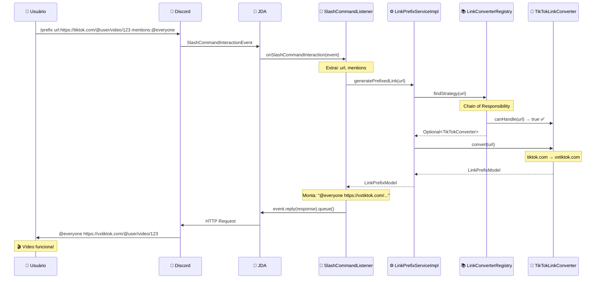

# ZeinzinhoBot - Fluxo Detalhado Passo a Passo

## 🎯 **Cenário de Exemplo**: Link do TikTok

**Comando**: `/prefix url:https://www.tiktok.com/@user/video/1234567890 mentions:@everyone`

---

## 📋 **PASSO 1: Usuário Digita o Comando**

**O que acontece:**

- Usuário digita no Discord: `/prefix url:https://www.tiktok.com/@user/video/1234567890 mentions:@everyone`
- Discord API recebe o comando e identifica como um Slash Command
- Discord procura o bot registrado para processar esse comando

**Comparação NestJS:**

```typescript
// NestJS seria algo assim:
@SlashCommand({ name: 'prefix' })
async handlePrefix(@Ctx() ctx: SlashCommandContext) { ... }
```

---

## 📋 **PASSO 2: JDA Intercepta o Evento**

**Arquivo envolvido:** `src/main/java/com/zeinzinho/zeinzinho_bot/infrastructure/config/DiscordConfig.java` (linha 16-35)

**O que acontece:**

1. **JDA Client** (Java Discord API) está "ouvindo" eventos do Discord
2. Quando um slash command chega, JDA cria um `SlashCommandInteractionEvent`
3. JDA procura por **listeners registrados** que podem processar esse evento

**Código relevante em `DiscordConfig.java`:**

```java
// Linha 25: JDA está configurado para "ouvir" eventos
discordJdaClient.addEventListener(messageListener, slashCommandListener);
```

**Como funciona:**

- `slashCommandListener` é nossa classe `SlashCommandListener`
- JDA automaticamente chama o método `onSlashCommandInteraction()` quando um slash command chega

**Comparação NestJS:**

```typescript
// NestJS: Decorators fazem o registro automático
// Java: Precisamos registrar manualmente os listeners
```

---

## 📋 **PASSO 3: SlashCommandListener Recebe o Evento**

**Arquivo envolvido:** `src/main/java/com/zeinzinho/zeinzinho_bot/application/listener/SlashCommandListener.java`

**O que acontece:**

1. JDA chama o método `onSlashCommandInteraction(SlashCommandInteractionEvent event)`
2. Este método herda de `ListenerAdapter` (classe do JDA)
3. O `event` contém TODAS as informações do comando

**Código linha por linha:**

```java
@Override
public void onSlashCommandInteraction(SlashCommandInteractionEvent event) {
```

**Detalhes do `event` object:**

- `event.getName()` = "prefix"
- `event.getOption("url")` = SlashCommandOption contendo "https://www.tiktok.com/@user/video/1234567890"
- `event.getOption("mentions")` = SlashCommandOption contendo "@everyone"

**Comparação NestJS:**

```typescript
// NestJS: Parâmetros já vêm parseados via decorators
async handlePrefix(@Option('url') url: string, @Option('mentions') mentions?: string)

// Java: Precisamos extrair manualmente do event object
String url = event.getOption("url").getAsString();
```

---

## 📋 **PASSO 4: Validação e Extração de Dados**

**Código executado:**

```java
if (event.getName().equals("prefix")) {  // Linha 19
    String url = event.getOption("url").getAsString();  // Linha 20
```

**O que acontece:**

1. **Verificação do comando**: Confirma que é o comando "prefix"
2. **Extração da URL**:
   - `event.getOption("url")` retorna um `OptionMapping`
   - `.getAsString()` converte para String
   - Resultado: `url = "https://www.tiktok.com/@user/video/1234567890"`

**Detalhe importante:**

- Se a opção "url" não existisse (obrigatória), JDA nem chegaria aqui
- Mas sempre é bom verificar com null-checks em produção

---

## 📋 **PASSO 5: Chamada do Service**

**Código executado:**

```java
LinkPrefixModel prefixedLink = linkPrefixService.generatePrefixedLink(url);  // Linha 22
```

**O que acontece:**

1. **Dependency Injection**: `linkPrefixService` foi injetado no construtor
2. **Chamada do método**: Chama `generatePrefixedLink()` passando a URL
3. **Tipo de retorno**: Espera receber um `LinkPrefixModel`

**Como a injeção funciona:**

```java
// No construtor (linha 14-16):
public SlashCommandListener(LinkPrefixService linkPrefixService) {
    this.linkPrefixService = linkPrefixService;
}
```

**Spring Framework:**

- Spring vê `@Component` na classe
- Spring vê que o construtor precisa de `LinkPrefixService`
- Spring procura uma implementação de `LinkPrefixService`
- Encontra `LinkPrefixServiceImpl` (que tem `@Service`)
- Spring cria uma instância e injeta automaticamente

**Comparação NestJS:**

```typescript
// NestJS:
constructor(private readonly linkPrefixService: LinkPrefixService) {}

// Java + Spring:
private final LinkPrefixService linkPrefixService;
public SlashCommandListener(LinkPrefixService linkPrefixService) {
    this.linkPrefixService = linkPrefixService;
}
```

---

## 📋 **PASSO 6: LinkPrefixServiceImpl Processa**

**Arquivo envolvido:** `src/main/java/com/zeinzinho/zeinzinho_bot/application/service/LinkPrefixServiceImpl.java`

**Código executado:**

```java
@Override
public LinkPrefixModel generatePrefixedLink(String originalUrl) {
    Optional<LinkConverterStrategy> strategy = registry.findStrategy(originalUrl);  // Linha 21
```

**O que acontece:**

1. **Interface vs Implementação**:
   - Listener chama a interface `LinkPrefixService`
   - Spring direciona para a implementação `LinkPrefixServiceImpl`
2. **Delegação**: Service delega a lógica para o Registry
3. **Strategy Pattern**: Registry vai encontrar a strategy correta

**Detalhe do `Optional`:**

- Java usa `Optional<T>` para evitar NullPointerException
- Similar ao `Maybe` do Haskell ou `?` do TypeScript
- Registry pode retornar "vazio" se não encontrar strategy

**Comparação NestJS:**

```typescript
// NestJS: Retornaria undefined ou null
findStrategy(url: string): LinkConverterStrategy | undefined

// Java: Usa Optional para ser explícito sobre "pode não existir"
findStrategy(String url): Optional<LinkConverterStrategy>
```

---

## 📋 **PASSO 7: LinkConverterRegistry Busca Strategy**

**Arquivo envolvido:** `src/main/java/com/zeinzinho/zeinzinho_bot/domain/registry/LinkConverterRegistry.java`

**Código executado:**

```java
public Optional<LinkConverterStrategy> findStrategy(String url) {
    return strategies.stream()                    // Linha 22
        .filter(strategy -> strategy.canHandle(url))  // Linha 23
        .findFirst();                             // Linha 24
}
```

**O que acontece PASSO A PASSO:**

1. **`strategies.stream()`**:

   - `strategies` é uma `List<LinkConverterStrategy>`
   - Spring injetou TODAS as classes que implementam `LinkConverterStrategy`
   - Lista contém: `[TwitterLinkConverter, RedditLinkConverter, TikTokLinkConverter, InstagramLinkConverter, YouTubeLinkConverter]`

2. **`.filter(strategy -> strategy.canHandle(url))`**:

   - **Chain of Responsibility Pattern**
   - Para cada strategy na lista, chama `canHandle("https://www.tiktok.com/@user/video/1234567890")`
   - Só mantém as strategies que retornam `true`

3. **`.findFirst()`**:
   - Pega a PRIMEIRA strategy que disse "eu consigo processar"
   - Retorna `Optional<LinkConverterStrategy>`

**Como o Spring injeta as strategies:**

```java
public LinkConverterRegistry(List<LinkConverterStrategy> strategies) {
    this.strategies = strategies;
}
```

- Spring encontra TODAS as classes `@Component` que implementam `LinkConverterStrategy`
- Cria uma lista e injeta automaticamente
- **Magia do Spring!**

---

## 📋 **PASSO 8: Testando Cada Strategy (Chain of Responsibility)**

Vamos ver strategy por strategy:

### **8.1: TwitterLinkConverter**

**Arquivo:** `src/main/java/com/zeinzinho/zeinzinho_bot/domain/service/strategy/TwitterLinkConverter.java`

```java
@Override
public boolean canHandle(String url) {
    return TWITTER_URL_PATTERN.matcher(url).matches();
}
```

- **Pattern**: `"https?://(?:www\\.)?(?:twitter\\.com|x\\.com)/([\\w]+)/status/(\\d+).*"`
- **URL testada**: `"https://www.tiktok.com/@user/video/1234567890"`
- **Resultado**: `false` (não é Twitter)

### **8.2: RedditLinkConverter**

**Arquivo:** `src/main/java/com/zeinzinho/zeinzinho_bot/domain/service/strategy/RedditLinkConverter.java`

```java
private static final Pattern REDDIT_PATTERN = Pattern.compile(
    "https?://(www\\.)?(reddit\\.com|old\\.reddit\\.com)/r/[^/]+/comments/[a-zA-Z0-9]+.*"
);
```

- **Pattern**: Procura por reddit.com/r/...
- **URL testada**: `"https://www.tiktok.com/@user/video/1234567890"`
- **Resultado**: `false` (não é Reddit)

### **8.3: TikTokLinkConverter** ⭐

**Arquivo:** `src/main/java/com/zeinzinho/zeinzinho_bot/domain/service/strategy/TikTokLinkConverter.java`

```java
private static final Pattern TIKTOK_PATTERN = Pattern.compile(
    "https?://(www\\.)?(tiktok\\.com|vm\\.tiktok\\.com).*"
);
```

- **Pattern**: Procura por tiktok.com
- **URL testada**: `"https://www.tiktok.com/@user/video/1234567890"`
- **Resultado**: `true` ✅ **ENCONTROU!**

### **Registry para de testar**

- `findFirst()` retorna imediatamente
- `Optional<TikTokLinkConverter>` é retornado

---

## 📋 **PASSO 9: De Volta ao Service**

**Código executado:**

```java
if (strategy.isEmpty()) {
    throw new IllegalArgumentException("No converter available for URL: " + originalUrl);
}

return strategy.get().convert(originalUrl);  // Linha 27
```

**O que acontece:**

1. **Verificação do Optional**:
   - `strategy.isEmpty()` = false (encontrou TikTokLinkConverter)
   - Não entra no if
2. **Chamada da conversão**:
   - `strategy.get()` extrai o TikTokLinkConverter do Optional
   - Chama `convert("https://www.tiktok.com/@user/video/1234567890")`

---

## 📋 **PASSO 10: TikTokLinkConverter Converte**

**Arquivo envolvido:** `src/main/java/com/zeinzinho/zeinzinho_bot/domain/service/strategy/TikTokLinkConverter.java`

**Código executado:**

```java
@Override
public LinkPrefixModel convert(String originalUrl) {
    if (!canHandle(originalUrl)) {
        throw new IllegalArgumentException("URL is not a valid TikTok link: " + originalUrl);
    }

    String prefixedUrl = originalUrl
        .replace("https://www.tiktok.com", "https://vxtiktok.com")
        .replace("https://tiktok.com", "https://vxtiktok.com")
        .replace("https://vm.tiktok.com", "https://vxtiktok.com");

    return new LinkPrefixModel(originalUrl, prefixedUrl);
}
```

**O que acontece PASSO A PASSO:**

1. **Validação dupla**: Verifica novamente se pode processar (defensive programming)
2. **Conversão**:
   - URL original: `"https://www.tiktok.com/@user/video/1234567890"`
   - Primeira replace: `"https://vxtiktok.com/@user/video/1234567890"`
   - Outras replaces não fazem nada (não tem match)
3. **Criação do Model**:
   - `new LinkPrefixModel(originalUrl, prefixedUrl)`
   - Cria objeto com URL original e convertida

---

## 📋 **PASSO 11: Volta Para o Listener**

**Código executado:**

```java
LinkPrefixModel prefixedLink = linkPrefixService.generatePrefixedLink(url);
String response = prefixedLink.getPrefixedUrl();  // Linha 23
```

**O que acontece:**

1. **Service retorna**: `LinkPrefixModel` com as duas URLs
2. **Extração da URL convertida**:
   - `prefixedLink.getPrefixedUrl()` = `"https://vxtiktok.com/@user/video/1234567890"`
   - `response` agora contém a URL convertida

---

## 📋 **PASSO 12: Processamento das Menções**

**Código executado:**

```java
if (event.getOption("mentions") != null) {  // Linha 25
    String mentions = event.getOption("mentions").getAsString();  // Linha 26
    response = mentions + " " + response;  // Linha 27
}
```

**O que acontece:**

1. **Verificação**: Usuário passou o parâmetro "mentions"?
2. **Extração**: `mentions = "@everyone"`
3. **Concatenação**:
   - `response = "@everyone" + " " + "https://vxtiktok.com/@user/video/1234567890"`
   - `response = "@everyone https://vxtiktok.com/@user/video/1234567890"`

---

## 📋 **PASSO 13: Envio da Resposta**

**Código executado:**

```java
event.reply(response).queue();  // Linha 29
```

**O que acontece:**

1. **`event.reply(response)`**:
   - Cria um `ReplyCallbackAction` do JDA
   - Prepara a resposta para o Discord
2. **`.queue()`**:
   - **Assíncrono!** Não bloqueia a thread
   - JDA envia a resposta em background
   - Similar ao `await` do JavaScript, mas não espera

**Comparação NestJS:**

```typescript
// NestJS:
await interaction.reply(response);

// Java + JDA:
event.reply(response).queue(); // Não-bloqueante
// OU
event.reply(response).complete(); // Bloqueante (sync)
```

---

## 📋 **PASSO 14: Discord Entrega a Resposta**

**O que acontece:**

1. **JDA → Discord API**: Envia HTTP request para Discord
2. **Discord processa**: Valida a mensagem, aplica permissões
3. **Discord entrega**: Mostra para todos no canal
4. **Resultado final**: `@everyone https://vxtiktok.com/@user/video/1234567890`
5. **Embed funciona**: vxtiktok.com mostra o vídeo direto no Discord!

---

## 🎯 **RESUMO DO FLUXO COMPLETO**



---

## 🔄 **Principais Diferenças NestJS vs Spring Boot**

| Aspecto              | NestJS                     | Spring Boot + Java                 |
| -------------------- | -------------------------- | ---------------------------------- |
| **DI**               | `@Injectable()` automático | `@Component/@Service` + construtor |
| **Params**           | `@Option()` decorator      | `event.getOption().getAsString()`  |
| **Async**            | `async/await`              | `.queue()` (non-blocking)          |
| **Error Handling**   | `try/catch` com async      | `try/catch` tradicional            |
| **Typing**           | TypeScript nativo          | Generics + Optional                |
| **Null Safety**      | `undefined \| null`        | `Optional<T>`                      |
| **Streams**          | Array methods              | Java Streams API                   |
| **Pattern Matching** | Switch/if                  | Regex + Pattern                    |

---

## 🎯 **Conceitos Chave para Quem Vem do NestJS**

### **1. Dependency Injection**

```typescript
// NestJS: Automatic
@Injectable()
export class MyService {}

// Spring: Manual constructor
@Service
public class MyService {
    public MyService(OtherService other) { ... }
}
```

### **2. Optional vs undefined**

```typescript
// NestJS: pode ser undefined
findUser(id: string): User | undefined

// Java: Optional explícito
Optional<User> findUser(String id)
```

### **3. Stream API vs Array Methods**

```typescript
// NestJS:
users.filter(u => u.active).map(u => u.name)[0]

// Java:
users.stream().filter(u -> u.isActive()).map(u -> u.getName()).findFirst()
```

### **4. Error Handling**

```typescript
// NestJS: try/catch com async
try {
    const result = await service.process();
} catch (error) { ... }

// Java: try/catch tradicional
try {
    LinkPrefixModel result = service.generatePrefixedLink(url);
} catch (IllegalArgumentException e) { ... }
```

---

## 🚀 **Próximos Passos para Aprender**

1. **Spring Boot Fundamentals**:

   - `@Component`, `@Service`, `@Repository`
   - Dependency Injection patterns
   - Application Properties

2. **Java 8+ Features**:

   - Streams API
   - Optional
   - Lambda expressions
   - Method references

3. **Design Patterns em Java**:

   - Strategy Pattern (já usamos!)
   - Factory Pattern
   - Observer Pattern (para eventos)

4. **Testing**:
   - JUnit 5
   - Mockito
   - Spring Boot Test

---

**Esta documentação detalha cada passo do fluxo de conversão de links, sendo especialmente útil para desenvolvedores vindos do ecossistema NestJS/TypeScript que estão aprendendo Spring Boot + Java.** 🎉
